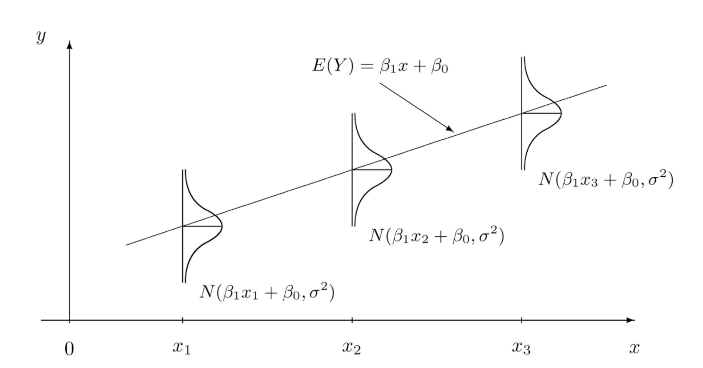

# General Linear Model 1

## General Linear Model 1——Linear Regression

### 1. What is Linear Regression?

1. It is one of the most well known/understood algorithm in statistics and machine learning
2. Linear regression is a **linear model​**, which a linear relationship between the input $$X$$ and output $$Y$$. More technical, we can consider $$Y$$ can be a **linear combination** of $$X$$

Quote: 我们的目的就是找到一条直线，使所有我们之前input的点到这条直线的距离最小。

3. The representation of simpliest linear regression can be written as

$$
Y= \beta_0+\beta_1X+\epsilon
$$

4. In statistics, this belongs to the parametric model, i.e. it has the parameter $$\beta_0$$ and $$\beta_1$$

(这里当然最好是$$Y= \beta_0+\beta_1X$$,，但是没办法我们有$\epsilon$,（但是我们知道它是normal）)

so, what is our target?

为了找 $$X$$和 $$Y$$的关系——Find the best $$\beta_0$$ and $$\beta_1$$ ——find total error 最小（loss function）——find Least square

### 2. The keys

#### 2.1 How to determine this model?(估计参数)

<mark style="color:blue;">**2.1.1 Loss function？（we can link the more general case for the loss function）**</mark>

​ 1. 如何我们要知道我们好不好呢？就需要看看error

​ $$Error=\vert y_i-y_i^{'}\vert$$

2. error 可以变化吗？可以,　但是为了好计算所以用squre
3. loss function=total error

<mark style="color:blue;">**2.1.2.最小二乘法least square推导loss function**</mark>

$$
Loss=\sum_{i=1}^{n} error^2=\sum_{i=1}^{n}(y_i-\beta_0+\beta_1X_i)^2
$$

1. 这里不一定要平方，但是平方和可以找到某种意义上的最好值
   1. 总的误差的平方最小的y就是真值，这个假设在误差是在随机波动下是最优的
   2. 所以我们可以来找 $$Loss =\min_{\beta_0,\beta_1} \sum_{i=1}^{n}(y_i-\beta_0+\beta_1X_i)^2$$
2. 因着是找 $$\beta_0$$ and $$\beta_1$$符合 $$\arg \min_{\beta_0,\beta_1} \sum_{i=1}^{n}(y_i-\beta_0+\beta_1X_i)^2$$
3. 所以我是在找$$\beta_0$$,$$\beta_1$$使得$$\sum_{i=1}^{n}(y_i-\beta_0+\beta_1X_i)^2$$最小，也就是loss的最小
4. 最小二乘法不永远是最优

<mark style="color:blue;">**一些提醒：**</mark>

1. least square（最小二乘法）是从cost function的角度，利用**距离**的定义建立目标函数；(注意最小二乘法是方法整个loss体系的建立可以link到statsitcal learning theory)
2. 经典的参数估计方法是从**概率的角度**建立目标，比如说最大似然估计MLE（maximum likelihood estimation）

<mark style="color:blue;">**2.1.3 最大似然估计MLE（maximum likelihood estimation）推导loss function**</mark>

1. mle是什么？
   1. mle is a method of estimating the parameters of a statistical model given obersvation, by finding the parameter values that maximize the likelihood of making the observation given the parameters. 用参数估计的方法，在有了一定的观测值之后，来找parameter，让我们可以最有可能看到我们观测值，让我们可以最大程度放大我们的观测值
2. 如果对于linear regression 来说，相当与用一个方法，**去找穿过最大可能性（最大密度）(尽可能多的概率)的那些点的线上**
   1. 同时这条线对于x来说是最大可能性分布所在的线（CLT）
   2. 见图

<figure><figcaption></figcaption></figure>

1. 别忘了我们要使用model里的assumption： p(y|x) 是 $$mean=\mu=f(x)$$(和$$x$$有关), $$variance=\sigma^2$$（和$$x$$无关）的normal distribution（or we consider $\varepsilon \sim N(0,\sigma^2)$）
2. 推导\*\*(面试必考题)\*\*
   1. we know that $$Y\vert X \sim N(\bar{\beta}_0+\bar{\beta}_1X, \sigma^2)$$
   2. $$
      p(Y_i\vert X_i)=\frac{1}{\sigma(2\pi)}e^{-\frac{1}{2\sigma^2}(Y_i-\bar{\beta}_0-\bar{\beta}_1X_i)^2}
      $$
3.  $$
    L(\bar{\beta}_0,\bar{\beta}_1,\sigma^2)=p(Y_1,\cdots,Y_n\vert X_1,\cdots,X_n)=\frac{1}{\sigma^{n}(2\pi)^{n/2}}e^{-\frac{1}{2\sigma^2}\sum_{i=1}^n(Y_i-\bar{\beta}_0-\bar{\beta}_1X_i)^2}
    $$

    under the assumption $$(X_1,Y_1),\cdots, (X_n,Y_n)$$ are independent

    where $$L(\bar{\beta}_0,\bar{\beta}_1,\sigma^2)=p(Y_1,\cdots,Y_n\vert X_1,\cdots,X_n)=p(Y_1\vert X_1,\cdots,X_n)\cdots p(Y_n\vert X_1,\cdots,X_n) =p(Y_1 \vert X_1)p(Y_2\vert X_2)\cdots p(Y_n\vert X_n)$$
4.  the corresponding the log function:(我只关心parameter，log函数不影响单调等数学性质)

    $$
    \log L(\bar{\beta}_0,\bar{\beta}_1,\sigma^2)=-n\log(\sqrt{2\pi}\sigma)-\frac{1}{2\sigma^2}\sum_{i=1}^n(Y_i-\bar{\beta}_0-\bar{\beta}_1X_i)^2
    $$

    所以我们要找的就是

    $$
    \arg \max -\sum_{i=1}^n(Y_i-\bar{\beta}_0-\bar{\beta}_1X_i)^2
    $$

    i.e.

    $$
    \arg \min \sum_{i=1}^n(Y_i-\bar{\beta}_0-\bar{\beta}_1X_i)^2
    $$

**两者关系？**

1. 当他们在linear regression下的assumption下，这两个方法得到结果是相通的
2. one is from statistics, and the other one is from optimization

**一点提醒：**

1. noise是数据造成的，是inherent bias. error是模型造成的，是人为的。是两个不同的概念

#### 2.2 How is the performance of this model?（这个是来看模型自己的好坏，评价自己的参数）

我们只能系统的保证其不会偏差（$E(Y)=\mu$)

Consider 这个问题，我们需要link到统计上的假设检验问题

null hypothesis : $$\beta_1=0$$

1. 目的是从统计上来判断这组数据和population相差多少，assessing the accuracy of the coefficient estimation,可以使用 $$p$$-value 或者是 confidence interval $$\hat{\beta}_1 \pm 2SE(\hat{\beta}_1)$$
2. 选择的统计量 $$t=\frac{\hat{\beta}_1-0}{SE(\hat{\beta}_1)}$$ where $$t$$ distribution with $$n-2$$ degrees of freedom assuming $$\beta_1=0$$

#### 2.3 How can we compare this model with others models?

(这个相当于模型外的判断模型的好坏 i.e. the extent to which the model fits the data)

1. assessing the overall accuracy
2. $$RSE=\sqrt{\frac{1}{n-2}RSS}=\sqrt{\frac{1}{n-2}\sum_i^{n}(y_i-\hat{y}_i)^2}$$
3. $$R^2=\frac{TSS-RRR}{TSS}=1-\frac{RSS}{\sum_i^{n}(y_i-\hat{y}_i)^2}$$,
4. where $$TSS$$ is total sum of squares, $RSS$ is the residual sum of squares(对误差的多少)
5. 当是simple regression时，他相同于correlation
6. 这里相当于 proportion of variability in $$Y$$ that can be explained using $$X$$ ($$Y$$ 的变化中能够被$X$解释的部分的比例 )

#### 2.4 GLM extra study with assumption？

https://zhuanlan.zhihu.com/p/22876460

## Multiple Linear Regression

We shall also put the notes in goodnotes here

1. interpreint regression coefficients:希望input 时uncorrelated；correlation 会影响；可以单独和output比较
2. RSS来判定好坏
3. Is at least one of the predictors $$X_1,\cdots, X_p$$ useful in predictiing the response? $$F$$ Statistic:
4. Do all the predictors help to explain $$Y$$, or is only a subset of the predictors useful? ​ (不可能经过所有的input；所以基于最小化$RSS$选择一个$$X_i$$，然后你基于最小化$$RSS$$选择第二个$$X_j$$，直到选出来的$$p$$-value合格)（或者你可以采用全部放进去，基于$$p$$-value,然后一个个删掉）
5. How well does the model fit the data?
   * systematic criteria for choosing an 'optimal' member in the path of models produced by forward or backward stepwise selection;
   * 其他度量方式 Mallow's $$C_p$$, Akaike information criterion(AIC), Bayesian information criterion(BIC), adjusted $$R^2$$, Cross-validation(CV)
6. Given a set of predictor values, what response value should we predict, and how accurate is our prediction
7. 小心qualitative data；可以换成binary $$x_1=0\&1$$在不同情况下，当然还可以有 $x\_2$
8. Removing the additive assumption: **interactions and nonlinearity**
   * Interaction:市场造成的相互的影响，比如说你增加$$x_1$$会影响$$x_2$$;这时候刚增加一个 $$x_1x_2$$项
   * hierarchy：hierarchy principle：if we include an interaction in a model, we should also include the main effects, even if the $p$-value associated with their coefficients are not significant.
9. outliers\&non-constant variance of error terms& high leverage points& collinearity section3.3

## Gradient descent简单的解释

Gradient descent is a commonly used optimization technique for other models as well, like neural networks, which we'll explore later in this track. Here's an overview of the gradient descent algorithm for a single-parameter linear regression model:

* select initial values for the parameter: $$a_1$$
* repeat until convergence (usually implemented with a max number of iterations):
  * calculate the error (MSE) of the model that uses the current parameter value: $$MSE(a_1)=\frac{1}{n}\sum_{i=1}^n({\hat{y}}^{(i)}-y^{(i)})^2$$
  * calculate the derivative of the error (MSE) at the current parameter value: $\frac{d}{da\_1}MSE(a\_1)$
  * update the parameter value by subtracting the derivative times a constant ($\alpha$, called the learning rate): $$a_1=a_1-\alpha \frac{d}{da_1}MSE(a_1)$$

Reference:

1. books: an introduction to statistical learning
2. notes in Good notes
3. lai notes
